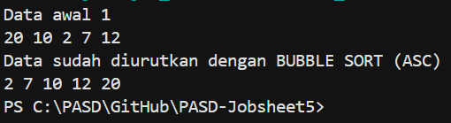
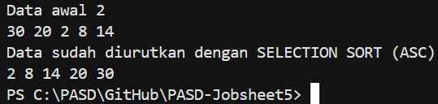
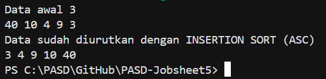
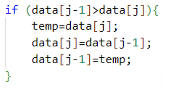

# JOBSHEET 5

# PRAKTIKUM 

## - Praktikum 1 : Mengimplementasikan Sorting menggunakan object

## - Praktikum 1 : Verifikasi Hasil Percobaan | SORTING - BUBBLE SORT



## - Praktikum 1 : Verifikasi Hasil Percobaan | SORTING - SELECTION SORT



## - Praktikum 1 : Verifikasi Hasil Percobaan | SORTING - INSERTION SORT



_Pertanyaan:_

1.  Jelaskan fungsi kode program berikut 



2.  Tunjukkan kode program yang merupakan algoritma pencarian nilai minimum pada selection sort!
3.  Pada Insertion sort, jelaskan maksud dari kondisi pada perulangan 
    while (j>=0 && data[j]>temp)

4.  Pada Insertion sort, apakah tujuan dari perintah data[j + 1] = data[j];

_Jawaban:_

1.  Kode ini adalah bagian dari algoritma Bubble Sort yang berfungsi untuk menukar posisi dua elemen array jika urutannya salah.
2.  Bagian kode program yang merupakan algoritma pencarian nilai minimum pada selection sort : 

    ```java
        int min = i;
        for (int j = i + 1; j < jumData; j++) {
            if (data[j] < data[min]){
                min = j;
            }
        }
    ```
3.  Penjelasan : 
    - j>=0 : Memastikan index tidak keluar dari batas Array (ke kiri)
    - data[j]>temp : Memeriksa apakah nilai di sebelah kiri (data[j]) lebih besar dari nilai yang ingin disisipkan (temp)
    - Jadi, kondisi ini berfungsi untuk mencari posisi yang tepat bagi temp dengan cara menggeser semua elemen yang lebih besar ke kanan
4.  Perintah ini berfungsi untuk menggeser elemen yang lebih besar ke kanan agar memberi tempat bagi elemen yang sedang disisipkan (temp)

