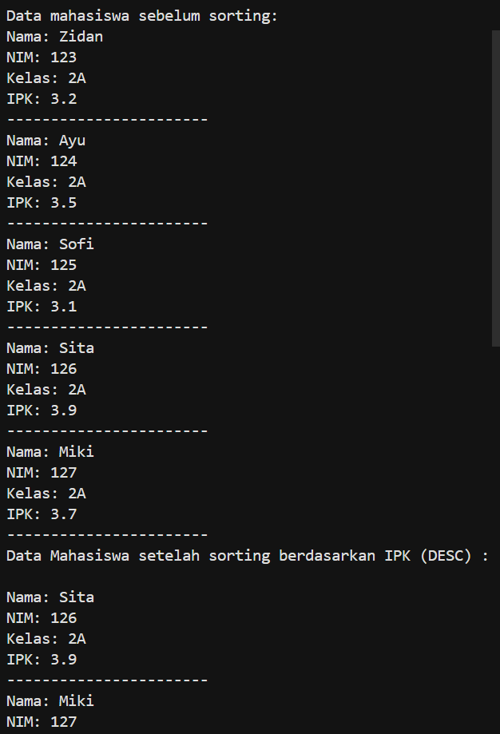
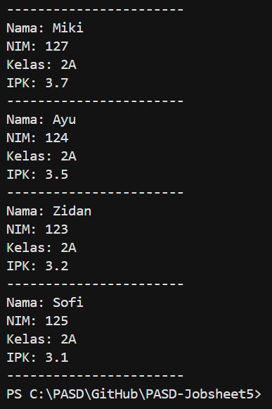
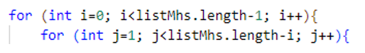
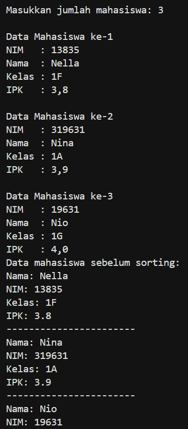
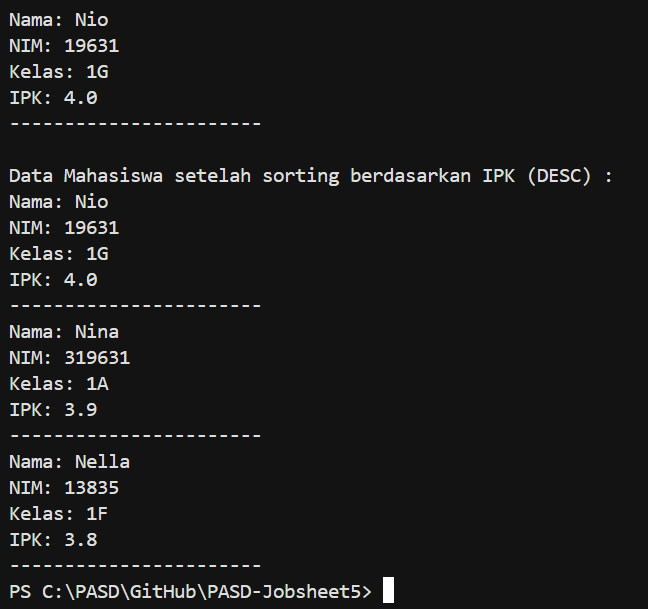

# JOBSHEET 5

# PRAKTIKUM 

## - Praktikum 1 : Mengimplementasikan Sorting menggunakan object

## - Praktikum 1 : Verifikasi Hasil Percobaan | SORTING - BUBBLE SORT


## - Praktikum 1 : Verifikasi Hasil Percobaan | SORTING - SELECTION SORT


## - Praktikum 1 : Verifikasi Hasil Percobaan | SORTING - INSERTION SORT


_Pertanyaan:_

1.  Jelaskan fungsi kode program berikut 


2.  Tunjukkan kode program yang merupakan algoritma pencarian nilai minimum pada selection sort!
3.  Pada Insertion sort, jelaskan maksud dari kondisi pada perulangan 
    while (j>=0 && data[j]>temp)

4.  Pada Insertion sort, apakah tujuan dari perintah data[j + 1] = data[j];

_Jawaban:_

1.  Kode ini adalah bagian dari algoritma Bubble Sort yang berfungsi untuk menukar posisi dua elemen array jika urutannya salah.
2.  Bagian kode program yang merupakan algoritma pencarian nilai minimum pada selection sort : 

    ```java
        int min = i;
        for (int j = i + 1; j < jumData; j++) {
            if (data[j] < data[min]){
                min = j;
            }
        }
    ```
3.  Penjelasan : 
    - j>=0 : Memastikan index tidak keluar dari batas Array (ke kiri)
    - data[j]>temp : Memeriksa apakah nilai di sebelah kiri (data[j]) lebih besar dari nilai yang ingin disisipkan (temp)
    - Jadi, kondisi ini berfungsi untuk mencari posisi yang tepat bagi temp dengan cara menggeser semua elemen yang lebih besar ke kanan
4.  Perintah ini berfungsi untuk menggeser elemen yang lebih besar ke kanan agar memberi tempat bagi elemen yang sedang disisipkan (temp)

## - Praktikum 2 : Mengurutkan Data Mahasiswa Berdasarkan IPK (Bubble Sort) 

## - Praktikum : Verifikasi Hasil Percobaan 





_Pertanyaan:_

1.  Perhatikan perulangan di dalam bubbleSort() di bawah ini:


a.  Mengapa syarat dari perulangan i adalah i < listMhs.length-1?
b.  Mengapa syarat dari perulangan j adalah j < listMhs.length-i?
c.  Jika banyak data di dalam listMhs adalah 50, maka berapakali perulangan i akan berlangsung? Dan ada berapa Tahap bubble sort yang ditempuh?
2.  Modifikasi program diatas dimana data mahasiswa bersifat dinamis (input dari keyboard) yang terdiri dari nim, nama, kelas, dan ipk!

_Jawaban:_

1.  a. Karena hanya butuh n-1 tahap untuk mengurutkan data 
    b. Karena sebagian data belakang sudah terurut : mengurangi perbandingan 
    c. Jika ada 50 : 
        - Perulangan i = 49 kali 
        - Tahap = 49 tahap 
2.  Code : 

    ```java
        package Praktikum05;

        import java.util.Scanner;

        public class MahasiswaDemo3 {
            public static void main(String[] args) {
                Scanner sc = new Scanner(System.in);

                MahasiswaBerprestasi3 list = new MahasiswaBerprestasi3();

                System.out.print("Masukkan jumlah mahasiswa: ");
                int jumlah = sc.nextInt();
                sc.nextLine(); 

                for (int i = 0; i < jumlah; i++) {
                    System.out.println("\nData Mahasiswa ke-" + (i+1));

                    System.out.print("NIM   : ");
                    String nim = sc.nextLine();

                    System.out.print("Nama  : ");
                    String nama = sc.nextLine();

                    System.out.print("Kelas : ");
                    String kelas = sc.nextLine();

                    System.out.print("IPK   : ");
                    double ipk = sc.nextDouble();
                    sc.nextLine();

                    Mahasiswa3 m = new Mahasiswa3(nim, nama, kelas, ipk);
                    list.tambah(m);
                }

                System.out.println("Data mahasiswa sebelum sorting: ");
                list.tampil();

                System.out.println("\nData Mahasiswa setelah sorting berdasarkan IPK (DESC) : ");
                list.bubbleSort();
                list.tampil();
            }
        }
    ```

    Output :

    

    


